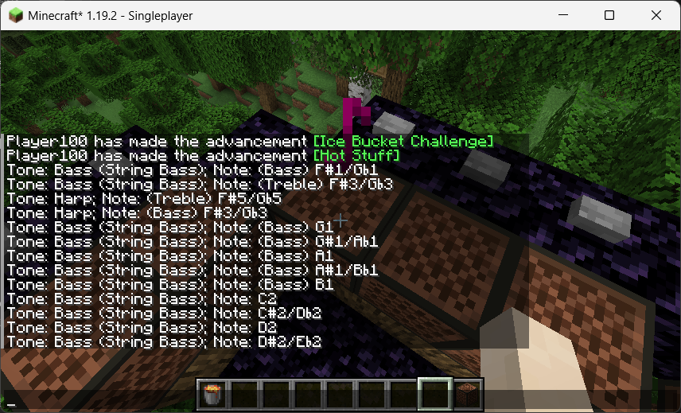

## ZhongLv-12ET

### Features

- Pure client-side mod.
- Note Recognition: This mod can identify notes played in Minecraft, whether from note blocks, commands, or plugins; the recognized note directly displays in player chat hud.

### Installation

1. Install Minecraft and Fabric Mod Loader;
2. Download Fabric API;
3. Download the mod: use the `.jar` file without "sources";
4. Enable the mod: place the mod in `mods` folder;

### Motivation

The inspiration for "ZhongLv-12ET" comes from a Boss mechanic in a DLC dungeon based on a [DLC pack](https://gitee.com/yulong-jiuqiu/panling) of [PAN-GU CONTINENT](https://pan-gu-continent.blogspot.com/) server, where players need to accurately identify note names to complete challenges.

This mechanic sparked the idea to develop a client-side mod that automatically recognizes and displays note information, making it easier for players to handle note-related tasks in the game.

### Sample

### References

When writing language files and calculating the pitch of notes, the following content is used:

[1] Wikipedia contributors. “Shi’er lü.” Wikipedia, 1 Sept. 2024, [en.wikipedia.org/wiki/Shi%27er_l%C3%BC](https://en.wikipedia.org/wiki/Shi%27er_l%C3%BC).

[2] Wikipedia contributors. “12 equal temperament.” Wikipedia, 4 June 2024, [en.wikipedia.org/wiki/12_equal_temperament](https://en.wikipedia.org/wiki/12_equal_temperament).

[3] Wikipedia contributors.  “Chinese musicology.” Wikipedia, 7 July 2024, [en.wikipedia.org/wiki/Chinese_musicology#Scale_and_tonality](https://en.wikipedia.org/wiki/Chinese_musicology#Scale_and_tonality).
