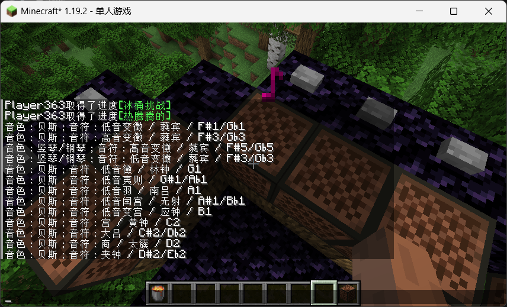

## 钟吕十二律

### 功能

- 纯粹的客户端 mod；
- 音符识别：该模组可以识别音符盒、命令和插件播放的音符，并将音符名称和音色直接显示在聊天区域中。

### 安装

1. 安装 Minecraft 本体和 Fabric Mod 加载器；
2. 安装 Fabric API；
3. 下载不带 sources 后缀的 `.jar` 模组文件；
4. 将模组放进 `mods` 文件夹即可启用。

### 创作动机

我受到一个基于 [梦回盘灵](https://gitee.com/yulong-jiuqiu/panling)（[盘灵古域](https://pan-gu-continent.blogspot.com/) DLC）的 DLC 副本机制的启发。该副本机制名为「钟吕符音」，意在使玩家辨认出音符并击杀对应怪物。

因为有很多玩家不具有识别具体音符的能力，拥有这个模组之后玩家可以知道到底播放了什么音符，可以更轻松的应对该机制。

### 使用效果

### 参考资料

在撰写语言文件、计算音符音高中，使用到了以下内容：

[1] 维基媒体项目贡献者. “十二律.” 维基百科，自由的百科全书, 5 Aug. 2024, [zh.wikipedia.org/wiki/%E5%8D%81%E4%BA%8C%E5%BE%8B](https://zh.wikipedia.org/wiki/%E5%8D%81%E4%BA%8C%E5%BE%8B).

[2] 维基媒体项目贡献者. “十二平均律.” 维基百科，自由的百科全书, 10 Apr. 2023, [zh.wikipedia.org/wiki/%E5%8D%81%E4%BA%8C%E5%B9%B3%E5%9D%87%E5%BE%8B](https://zh.wikipedia.org/wiki/%E5%8D%81%E4%BA%8C%E5%B9%B3%E5%9D%87%E5%BE%8B).

[3] 维基媒体项目贡献者. “中国五声音阶.” 维基百科，自由的百科全书, 3 July 2024, [zh.wikipedia.org/zh-cn/%E4%B8%AD%E5%9C%8B%E4%BA%94%E8%81%B2%E9%9F%B3%E9%9A%8E](https://zh.wikipedia.org/zh-cn/%E4%B8%AD%E5%9C%8B%E4%BA%94%E8%81%B2%E9%9F%B3%E9%9A%8E).
